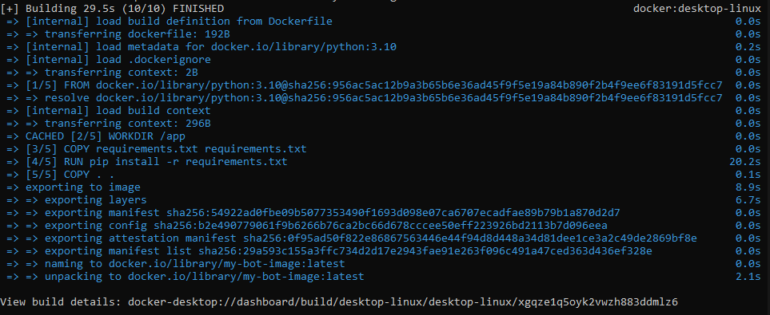
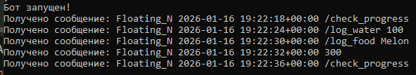

Ссылка на бота: https://t.me/Trade_Nicolas_bot

HELP:
- /set_profile - Создание профиля
- /start_day - Начать день и трекинг калорий на день
- /log_water <количество в мл> - Записать выпитую воду
- /log_food <название еды на английском> - Найти и записать съеденную еду
- /log_workout <название тренировки из списка> - Записать тренировку
- /check_progress - Вывести графики и прогресс в дне

TODO:
- Не написано экранирование ввода, это может привести к sql инъекциям и в целом в некоторых случаях неправильному поведению бота, хоть он и не сломается (предположительно)
- Если в log_food не указана еда, то можно предложить написать "рецепт", это просто одно сообщение где заголовок - название рецепта, а остальные строки, название еды и количество грамм, check_recepie в свою очередь можно использовать чтобы выводить сохранённые таким образом рецепты, чтобы их можно было скопировать в своё сообщение и отредактировать количество грамм каждого продукта
- Рефактор кода и разнесение отдельных блоков в свои routes и в свои файлы (тут просто времени уже не осталось сделать)
- Вынести в отдельный файл типы тренировок или добавть больше вариаций в подсчёте сожжёных калорий
- Inline keyboard при log_food, чтобы было проще выбрать продукт из базы USDA

Comments:
Отдельно хочу уточнить, что я использовал только самый малую часть базы usda, потому что она самая простая по поиску, ну и к ней не требуется дописывать inline keyboard, в идеале использовать полную базу, и выдавать ответы в виде клавиатуры

Images:

